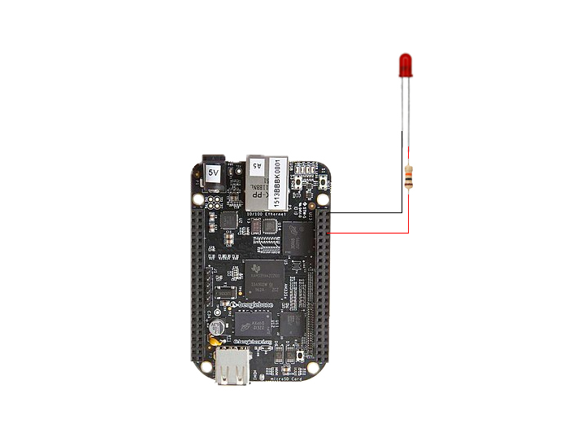

# Artigo - Como agendar a execução de um programa no Linux 


Este é o repositório dedicado á armazenar o código desenvolvido para ser apresentado no [artigo](http://www.embarcados.com.br)

## Antes de Executar

Abaixo são apresentados os procedimentos necessários para executar o código

### Instalar bibliotecas

Para instalar as bibliotecas, digite o seguinte comando no terminal.

``` 
    pip3 install -r requirements.txt
```

### Conexão com o hardware

Para o correto funcionamento, conecte os periféricos conforme a figura abaixo




## Executando

Para executar o script, digite o comando abaixo seguido pelo argumento **led**. Lembrando que o argumento aceita apendas os valores

 - on
 - off

Para ligar o LED digite:
```
    python3 teste-cron.py --led=on
```

Para desligar o LED digite:
```
    python3 teste-cron.py --led=off
```